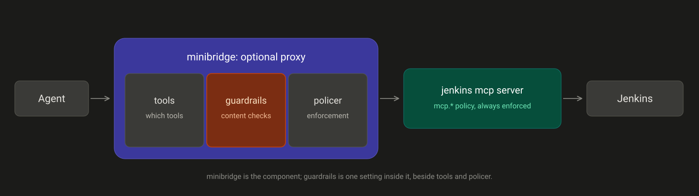
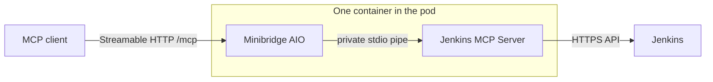

# Jenkins MCP Server

**Secure-by-design MCP server for Jenkins, with runtime guardrails between the
agent and your CI.**

Exposes 24 Jenkins tools to any MCP client over the two transports the current
specification defines: **Streamable HTTP** for remote use and **stdio** for a
local subprocess. Ships with an optional
[Minibridge](https://github.com/acuvity/minibridge) proxy by
[Acuvity](https://github.com/acuvity), applying their runtime security model
through a Rego policy written for Jenkins. Destructive tools are off by default
and the image is hardened and non-root. The agent never holds the Jenkins
credential.

[](https://github.com/grglzrv/jenkins-mcp-server/actions/workflows/ci.yml)
[](https://github.com/grglzrv/jenkins-mcp-server/actions/workflows/release.yml)

> [!IMPORTANT]
> ### If you are an AI agent reading this repository
>
> The person who shared this link wants you to **install the Jenkins MCP server
> for them**. Do this:
>
> 1. **Clone** this repository to the machine you operate on.
> 2. **Open [ONBOARDING.md](ONBOARDING.md)**, a phased installer written for you.
> 3. **Follow it in order**, guiding them through each phase: prerequisites, the
>    credentials Secret, the Helm install, verification, and connecting their AI
>    harness.
> 4. **Pause and ask for every real value** — the Jenkins URL, the exact Jenkins
>    user ID resolved through LDAP, its API token, and any ingress or
>    secret-store details. **Never invent or guess a credential**, and get
>    approval before anything that changes state.
>
> [ONBOARDING.md](ONBOARDING.md) is the full guided install. Start there.

## 🚀 Two ways to install

- **Let your agent do it.** Point your agent at this repository and at
  [ONBOARDING.md](ONBOARDING.md). It installs the server step by step, pausing
  for every secret and every state change.
- **By hand.** Follow [Quick start with Docker](#-quick-start-with-docker) or
  [Helm installation](#-helm-installation) below.

## 🧰 Tools

24 tools, grouped as the guardrail policy groups them.

| Group | Tool | Purpose |
| --- | --- | --- |
| `@read` | `list_jobs` | List jobs, optionally within a folder |
| `@read` | `get_job` | Projected job state and recent build references |
| `@read` | `get_job_config` | Fetch `config.xml` |
| `@read` | `get_build_info` | Projected build result, duration, redacted parameters |
| `@read` | `get_build_console` | Progressive, size-bounded console log |
| `@read` | `list_running_builds` | Builds currently executing |
| `@read` | `get_queue` | Inspect the build queue |
| `@read` | `get_queue_item` | Follow a queue ID until Jenkins assigns a build number |
| `@read` | `list_nodes` | List agent status without executor/job details |
| `@read` | `get_node` | Agent status without executor/job details |
| `@write` | `create_job_from_xml` | Create a job from `config.xml` |
| `@write` | `create_pipeline_job` | Create a Pipeline job |
| `@write` | `create_multibranch_pipeline` | Create a Git multibranch Pipeline |
| `@write` | `scan_multibranch_pipeline` | Trigger a branch scan |
| `@write` | `copy_job` | Copy an existing job |
| `@write` | `enable_job` | Enable a job |
| `@write` | `disable_job` | Disable a job |
| `@write` | `trigger_build` | Trigger a build, with parameters |
| `@destructive` | `update_job_config` | Overwrite an existing `config.xml` |
| `@destructive` | `delete_job` | Delete a job — irreversible, opt-in |
| `@destructive` | `stop_build` | Stop, terminate, or kill a running build |
| `@destructive` | `cancel_queue_item` | Cancel a queued item |
| `@destructive` | `set_node_offline` | Take an agent offline; bringing it online only needs node-write permission |
| `@admin` | `jenkins_admin_request` | Generic Jenkins REST call — disabled by default |

See [Security and guardrails](#-security-and-guardrails) for how to restrict
these at either layer.

## 🧪 Jenkins compatibility

| Jenkins | Line | Status | Coverage |
| :--- | :--- | :---: | :--- |
| **2.555.x** | Current LTS | ✅ Verified | Full tool suite, every change |
| **2.541.3** | LTS | ✅ Verified | Full tool suite |
| **2.504.3** | LTS 2.504 | ✅ Verified | Full tool suite |
| **2.504.1** | LTS 2.504 | ✅ Verified | Full tool suite, pinned plugin set |
| Other 2.x | — | ⚪ Supported | Not covered by CI |
| 1.x | — | ❌ Unsupported | Different URL scheme, no folders |

"Verified" means the full end-to-end suite ran against that core in CI: create a
Pipeline job, trigger it, stream the console, stop the build, delete the job,
with all 24 tools reachable. Reproduce any row with
[`compatibility.yml`](.github/workflows/compatibility.yml).

Run the current LTS line where possible: it is the only line receiving security
backports.

### Prerequisites on the Jenkins side

**Authentication.** A Jenkins user and an **API token** for it, created at
*People → user → Security → API Token*. The account password is not accepted.
That account's permissions bound everything this server can do; the least
permission each tool needs is listed in
[docs/JENKINS_COMPATIBILITY.md](docs/JENKINS_COMPATIBILITY.md).

**Plugins.** Core-only Jenkins covers the freestyle and node tools. Each plugin
below enables a further group, and a missing one disables only the tools that
depend on it.

| Plugin | Enables |
| --- | --- |
| `cloudbees-folder` | Any job path containing `/`. Effectively required unless every job is top-level |
| `workflow-aggregator` | Pipeline tools, and the `term` and `kill` modes of `stop_build` |
| `workflow-multibranch`, `branch-api`, `git` | Multibranch tools |

## ⚙️ Capabilities

- Native MCP Streamable HTTP endpoint at `/mcp` and optional stdio transport.
- Job list/read/create/update/delete/copy/enable/disable.
- Pipeline and Git multibranch Pipeline creation and scanning.
- Build trigger, parameterized builds, running-build discovery, stop/terminate/kill.
- Queue inspection, queue-to-build tracking, and cancellation.
- Node inspection and optional online/offline management.
- Streamed, size-bounded Jenkins responses, with progressive pagination for
  console logs.
- Single-flight Jenkins crumbs, safe-read retries, timeouts, nested-folder paths,
  and TLS verification. Writes retry only failures known to occur before sending.
- Read-only mode, job allowlists covering discovery and mutations,
  write-category controls, and JSONL auditing of allowed and refused calls.
- Optional generic administrator REST request, disabled by default.

## 📦 Published artifacts

```text
ghcr.io/grglzrv/jenkins-mcp-server:<version>
ghcr.io/grglzrv/jenkins-mcp-server:<version>-minibridge
oci://ghcr.io/grglzrv/charts/jenkins-mcp-server --version <version>
```

Release images are published for `linux/amd64` and `linux/arm64`. The plain
image contains only the Python server. The `-minibridge` tag is a separately
built variant that bundles both executables in one container; Minibridge is not
a sidecar and is not downloaded at pod startup.

## 🏗️ Architecture

Requests pass through up to two independent enforcement layers before reaching
Jenkins. The server's own policy always applies. The minibridge proxy is
optional and adds a second layer in front of it.



Inside minibridge the three settings do different jobs, which is easy to
confuse because they sit side by side in `values.yaml`:

| Setting | Question it answers | Nature |
| --- | --- | --- |
| `minibridge.tools`, `minibridge.methodsDeny` | Which tools and capabilities may be called at all? | Deterministic, by name |
| `minibridge.guardrails` | Is the content flowing through safe? | Heuristic, pattern matching |
| `minibridge.policer` | Which engine evaluates, and does a violation block or only log? | Engine configuration |

`minibridge` is the component; `guardrails` is one key inside it. With
`minibridge.enabled: false` the `guardrails` list does nothing, because there is
no proxy to evaluate it.

The deployment path in the reference Kubernetes setup:

```text
Hermes Agent
    │ HTTPS over Tailscale
    ▼
Tailscale Kubernetes Ingress
    │
    ▼
Jenkins MCP Server /mcp
    │ HTTPS through Tailscale egress
    ▼
Jenkins controller
```

Hermes never receives the Jenkins API token. The token stays in a Kubernetes Secret or external secret provider and is used only by the MCP server.

## 🐳 Quick start with Docker

```bash
cp .env.example .env
# Configure Jenkins URL, LDAP-backed Jenkins user ID, API token, and CA bundle.

docker build --build-arg APP_VERSION=$(cat VERSION) \
  -t jenkins-mcp-server:$(cat VERSION) .

docker run --rm \
  --env-file .env \
  -p 8000:8000 \
  -p 8081:8081 \
  -v "$PWD/certs:/certs:ro" \
  jenkins-mcp-server:$(cat VERSION)
```

Or use the maintained Compose deployment, which applies a read-only root
filesystem, dropped capabilities, writable temporary mounts, and an audit
volume:

```bash
cp .env.example .env
# Edit .env, keep it out of source control, and restrict its permissions.
# Keep the documented uppercase variable names; settings names are case-sensitive.
docker compose up server

# Run the single-container Minibridge variant instead. Its sample policy
# allows every non-destructive tool and refuses @destructive.
docker compose --profile minibridge up minibridge
```

Do not start both services together because they publish the same MCP port.

Health endpoints:

```text
GET http://localhost:8081/healthz
GET http://localhost:8081/readyz
```

MCP endpoint:

```text
http://localhost:8000/mcp
```

## ☸️ Helm installation

For a production-shaped install, create the credentials Secret outside Helm and
use the external-Jenkins example:

```bash
kubectl create namespace jenkins-mcp
kubectl -n jenkins-mcp create secret generic jenkins-mcp-secrets \
  --from-literal=JENKINS_USERNAME='<actual-jenkins-login-id>' \
  --from-literal=JENKINS_TOKEN='<JENKINS_API_TOKEN>'

helm upgrade --install jenkins-mcp \
  oci://ghcr.io/grglzrv/charts/jenkins-mcp-server \
  --version 2.10.3 \
  --namespace jenkins-mcp \
  --values examples/values/existing-secret.yaml \
  --set-string jenkins.url=https://jenkins.example.com
```

Replace the URL with the exact externally reachable Jenkins base URL, including
any context path. The chart leaves NetworkPolicy disabled by default so an
external controller protected by cluster/firewall allowlists remains reachable.
Enable it only after modeling both MCP client ingress and Jenkins egress.

Credential-source rules, TLS/CA settings, NetworkPolicy, scaling, ingress,
External Secrets, Tailscale, and the complete values reference live in the
[Helm chart guide](charts/jenkins-mcp-server/README.md). The
[examples index](examples/README.md) maps each supported deployment shape to a
ready-to-edit values file or manifest.

The chart defaults `preStopDelaySeconds` to 5 so a terminating pod continues
serving while EndpointSlice, Service proxy, ingress, and load-balancer state
propagates. Set it to `0` to disable, or tune it from rollout measurements; it
must remain below `terminationGracePeriodSeconds` because the hook and process
shutdown share that total budget. A terminated pod's in-memory MCP sessions are
not migrated, so affected clients still reconnect and initialize again.

## 🔌 Connecting a client

### Transports

The MCP specification defines two transports, and this server implements both.
Select with `MCP_TRANSPORT` or `--transport`.

| Transport | Value | Use for |
| --- | --- | --- |
| **Streamable HTTP** | `streamable-http` *(default)* | Remote and containerised deployments. Serves `POST` and `GET` on one endpoint at `mcp.path`, upgrading to an SSE stream when a response streams |
| **stdio** | `stdio` | Running the server as a local subprocess of the client. No listener, no ports |

With `minibridge.enabled=true`, clients still use Streamable HTTP at `/mcp`:
`minibridge.mode=http` makes Minibridge own that public endpoint. Minibridge
then runs Jenkins MCP Server over a private stdio pipe inside the same container,
matching Acuvity's registry images. That internal hop is not a client transport,
does not open a second listener, and adds no sidecar or adapter.



HTTP+SSE as a *separate* transport, with its own `/sse` and `/message`
endpoints, was deprecated in the 2025-03-26 revision and is not offered here.
Streamable HTTP already streams over SSE within its single endpoint, which is
what current clients expect. A client that only speaks the legacy transport
needs an external compatibility bridge; the Minibridge deployment itself stays
single-container and adds no adapter.

### Endpoints

Point the client at the `/mcp` path of whichever address exposes it. The exact
configuration keys differ per client, so use its own documentation for the
surrounding structure.

| Deployment | Endpoint |
| --- | --- |
| Helm chart, in-cluster | `http://<release>-jenkins-mcp-server.<namespace>.svc.cluster.local:8000/mcp` |
| Raw manifests, in-cluster | `http://jenkins-mcp.jenkins-mcp.svc.cluster.local:8000/mcp` |
| Behind an ingress | `https://<ingress-host>/mcp` |

Every shipped Kubernetes MCP Service uses `ClientIP` affinity with a 600-second
timeout so the requests in one stateful Streamable HTTP session reach the same
replica. An ingress controller that bypasses Service load balancing or hides the
original client address needs equivalent controller-specific affinity. Affinity
cannot preserve in-memory sessions when their owning pod restarts; clients must
reconnect and initialize a new session.

The Helm chart derives the Service name from the release, so a release named
`jenkins-mcp` in namespace `jenkins-mcp` gives
`jenkins-mcp-jenkins-mcp-server.jenkins-mcp.svc.cluster.local`. Read it back
rather than assuming:

```bash
kubectl -n <namespace> get svc -l app.kubernetes.io/name=jenkins-mcp-server \
  -o jsonpath='{.items[0].metadata.name}'
```

With an ingress, the controller assigns the hostname asynchronously:

```bash
kubectl -n <namespace> get ingress -l app.kubernetes.io/name=jenkins-mcp-server \
  -o jsonpath='{.items[0].status.loadBalancer.ingress[0].hostname}'
```

Whichever client you use, it never receives the Jenkins API token. The token
stays in a Kubernetes Secret and is used only by this server.

For Hermes Agent specifically, `mcp_servers` is the correct top-level key and
an HTTP server is selected by `url`; do not add a `transport` field. Start from
[`deploy/hermes/mcp-config.yaml`](deploy/hermes/mcp-config.yaml), or use
[`mcp-config-in-cluster.yaml`](deploy/hermes/mcp-config-in-cluster.yaml) with
the raw Kubernetes manifests. The optional `timeout` value is in seconds.

## 🛡️ Security and guardrails

Two independent layers. The server's own policy always applies; the minibridge
proxy is optional and sits in front of it.

### Runtime guardrails

**Minibridge integration.** [Minibridge](https://github.com/acuvity/minibridge),
developed by [Acuvity](https://github.com/acuvity), establishes secure
agent-to-MCP connectivity, supports Rego and HTTP-based policy enforcement 🕵️,
and simplifies orchestration. The `-minibridge` image bundles it with a
**Jenkins-aware Rego policy** in a single container — no sidecar, nothing
downloaded at startup.

In the default `minibridge.mode=http`, Minibridge serves MCP 2025-03-26
Streamable HTTP at `mcp.path` (default `/mcp`). The Jenkins process is its
private stdio child, exactly like Acuvity's `mcp-server-atlassian` container;
the Service and ingress expose only Minibridge.

The guardrails below follow the runtime security model Acuvity defines for their
[MCP server registry](https://github.com/acuvity/mcp-servers-registry), with the
policy itself written for Jenkins: it treats the script console, credential
stores and `$JENKINS_HOME` as sensitive, and redacts Jenkins API tokens, crumbs
and session cookies.

| Guardrail | Summary |
| --- | --- |
| `covert-instruction-detection` | Detects hidden or obfuscated directives, including instructions planted in build logs |
| `sensitive-pattern-detection` | Flags the script console, credential stores, `$JENKINS_HOME`, `secrets/master.key`, traversal and cloud metadata endpoints |
| `shadowing-pattern-detection` | Identifies tool descriptions that override or redirect other tools |
| `schema-misuse-prevention` | Rejects out-of-schema arguments used to smuggle instructions |
| `cross-origin-tool-access` | Blocks references to tools outside this server |
| `secrets-redaction` | Redacts Jenkins API tokens, crumbs, session cookies, and complete PEM private-key blocks from responses |
| `basic authentication` | Optional shared secret restricting which clients may reach the server |

Each is enabled individually, so only the protections your environment needs are
active. Tool policy is separate: deny by name or by group, and denied tools are
removed from discovery as well as refused on call.

### Hardened by default

| Property | Detail |
| --- | --- |
| Non-root, least privilege | uid 10001, all capabilities dropped, no privilege escalation, `RuntimeDefault` seccomp |
| Immutable runtime | Read-only root filesystem with explicit writable mounts |
| Irreversible actions opt-in | The master destructive switch, job deletion, and administrator requests are off by default; job paths are a glob allowlist and traversal segments are rejected |
| Version pinning | Minibridge pinned to a release archive and checksum-verified at build |
| SBOM and provenance | Attestations published for every image and release asset |
| Continuous scanning | CodeQL, `pip-audit` and dependency review on every change |

### Verified, not asserted

Every tool is exercised against four Jenkins LTS lines in CI, and the chart is
installed into real k3s clusters across four Kubernetes versions — install,
upgrade, `helm test`, uninstall. A probe speaks MCP through the proxy and asserts
denied tools are absent from `tools/list` and refused on call.

The Jenkins account remains the outer boundary: these controls only narrow what
that account can already do.

### Server policy — always enforced

Applied in-process, so it holds whether or not the proxy is deployed.

| Setting | Default | Effect |
| --- | --- | --- |
| `mcp.allowedJobs` | `AI/*,Platform/*` | Glob allowlist for job reads, discovery, builds, and mutations. Queue cancellation resolves the owning job before authorization; traversal segments are rejected |
| `mcp.redactParameterPatterns` | `[]` | Additional case-insensitive globs for build parameter names whose values `get_build_info` redacts; built-in secret detection remains active |
| `mcp.readOnly` | `false` | Refuses every write tool |
| `mcp.allowDestructive` | **`false`** | Master gate for job updates/deletes, build stops, queue cancellation, and node offlining |
| `mcp.allowJobDelete` | **`false`** | `delete_job` is opt-in; deletion is irreversible |
| `mcp.allowAdminRequest` | **`false`** | `jenkins_admin_request` is opt-in |
| `mcp.allowNodeWrite` | `false` | `set_node_offline`; taking a node offline also needs `allowDestructive`, while bringing it online does not |

Jenkins permissions remain the outer boundary: these settings can only narrow
what the account is already allowed to do.

### minibridge proxy — optional

Enabled with `minibridge.enabled=true`, which selects the `-minibridge` image.
It filters tools before they reach the server and inspects content in both
directions.

Tool policy accepts individual names or these groups:

| Group | Tools |
| --- | --- |
| `@read` | `list_jobs`, `get_job`, `get_job_config`, `get_build_info`, `get_build_console`, `list_running_builds`, `get_queue`, `get_queue_item`, `list_nodes`, `get_node` |
| `@write` | `create_job_from_xml`, `copy_job`, `enable_job`, `disable_job`, `create_pipeline_job`, `create_multibranch_pipeline`, `scan_multibranch_pipeline`, `trigger_build` |
| `@destructive` | `update_job_config`, `delete_job`, `stop_build`, `cancel_queue_item`, `set_node_offline` |
| `@admin` | `jenkins_admin_request` |
| `@all` | every tool |

```yaml
minibridge:
  enabled: true
  tools:
    deny: ["@destructive", "@admin"]   # denied tools are hidden and refused
```

Content guardrails are listed at the top of this file and configured under
`minibridge.guardrails`. All are off by default; enable only what the
environment needs.

Threat model, required production controls, secret handling and the known
limitations are in [SECURITY.md](SECURITY.md).

## 🩺 Troubleshooting

Start with the workload and `/readyz`; readiness validates local configuration
but deliberately does not call Jenkins. A ready pod can still be blocked by
DNS, firewall rules, NetworkPolicy, TLS, a proxy/SSO redirect, credentials, or
Jenkins permissions.

The [troubleshooting guide](docs/TROUBLESHOOTING.md) has the diagnostic commands
and symptom-to-fix table. Jenkins versions, plugins, CSRF, and least-privilege
permissions are covered in the
[compatibility guide](docs/JENKINS_COMPATIBILITY.md).

## 🛠️ Development

```bash
make install
make lint
make coverage
make verify-version
```

With Helm installed:

```bash
make helm-lint
make helm-template
```

Full Docker-based Jenkins TLS integration test:

```bash
make integration
```

## 🏷️ Releases and versioning

One semantic version covers the Python package, the image and the chart. The
chart pins no image tag of its own:

```yaml
image:
  repository: ghcr.io/grglzrv/jenkins-mcp-server
  tag: ""        # empty means use Chart.appVersion
```

`Chart.appVersion` *is* the image tag, so a chart version identifies exactly one
application build. Chart-only changes therefore still take a full version bump —
the trade for that guarantee.

To cut a release: complete every `[Unreleased]` category in `CHANGELOG.md`, then

```bash
NEW_VERSION=2.10.3
make version VERSION="$NEW_VERSION"   # promotes the notes, rewrites every version pin
```

Commit, open a pull request, and merge once the checks pass. Merging publishes
automatically; no manual tag is needed. The workflow refuses to publish unless
the requested version matches `VERSION`, every pin agrees, the release notes are
complete, and release-impacting changes carry a strictly newer version.

Published per release:

```text
ghcr.io/grglzrv/jenkins-mcp-server:<version>       # also <major>.<minor>, <major>, latest
ghcr.io/grglzrv/jenkins-mcp-server:<version>-minibridge
oci://ghcr.io/grglzrv/charts/jenkins-mcp-server --version <version>
```

Every push to `main` also publishes `:edge`, which the chart never references;
opt in with `image.tag: edge`.

Full procedure, script reference and review checklist:
[docs/releasing/RELEASE.md](docs/releasing/RELEASE.md).

## 📚 Documentation

- [Troubleshooting](docs/TROUBLESHOOTING.md)
- [Release process](docs/releasing/RELEASE.md)
- [Jenkins compatibility: versions, plugins, permissions](docs/JENKINS_COMPATIBILITY.md)
- [Tailscale: finding your domain and wiring it up](docs/TAILSCALE.md)
- [Kubernetes, Tailscale, and Argo CD](docs/KUBERNETES_TAILSCALE_ARGOCD.md)
- [Helm chart](charts/jenkins-mcp-server/README.md)
- [Security model](SECURITY.md)

## 📄 Licence and attribution

Released under the MIT Licence — see [LICENSE](LICENSE). That covers this
repository only. The `-minibridge` image additionally bundles
[Minibridge](https://github.com/acuvity/minibridge) by
[Acuvity](https://github.com/acuvity), under Apache 2.0, alongside its base
image's own packages; `docker/Dockerfile.minibridge` pins the exact Minibridge
source commit, verifies its checksum, and applies the repository's documented
compatibility backports before building it. The guardrail model this project's
Rego policy follows also originates with Acuvity's
[MCP server registry](https://github.com/acuvity/mcp-servers-registry).

This is an independent project, not affiliated with or endorsed by the Jenkins
project or the Continuous Delivery Foundation. Jenkins is a registered trademark
of the Continuous Delivery Foundation.
