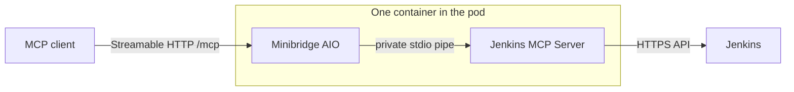

# Jenkins MCP Server Helm Chart

Deploys the Jenkins MCP server with secure defaults and optional Tailscale Operator integration.

## Kubernetes compatibility

`Chart.yaml` declares `kubeVersion: ">=1.27.0-0"`, and Helm refuses to install
on anything older. Beyond rendering, each row below is the chart being installed
into a real k3s cluster by
[`chart-smoke.yml`](../../.github/workflows/chart-smoke.yml): the manifests are
accepted by the API server, the pod starts, the probes pass, the chart's own
test pod reaches the Service through the NetworkPolicy, an upgrade over the
existing release succeeds, and uninstall leaves nothing behind.

| Kubernetes | k3s image tested | Result |
| --- | --- | --- |
| 1.36 | `v1.36.2+k3s1` | ✅ install, upgrade and uninstall verified |
| 1.35 | `v1.35.6+k3s1` | ✅ install, upgrade and uninstall verified |
| 1.34 | `v1.34.9+k3s1` | ✅ install, upgrade and uninstall verified |
| 1.33 | `v1.33.13+k3s1` | ✅ install, upgrade and uninstall verified |
| 1.27 – 1.32 | ⚙️ rendered only | Above the declared minimum; not installed in CI |
| < 1.27 | ❌ refused | `kubeVersion` blocks it |

Each run performs, in order: install with `--wait`, `rollout status`,
`Deployment` becoming Available, `helm test` (which reaches the Service through
the NetworkPolicy), a request to the MCP endpoint, `helm upgrade` over the
existing release, and `helm uninstall` verified to leave no chart-owned resource
behind. The image is built from the commit under test and imported into the
cluster, so the chart is exercised against that code rather than a published tag.

It runs on every change and again as a release gate, so a chart that cannot
install never gets published.

### API versions used

All generally available, none deprecated in the supported range:

| Resource | apiVersion |
| --- | --- |
| Deployment | `apps/v1` |
| Service, ServiceAccount, ConfigMap, Secret | `v1` |
| Ingress | `networking.k8s.io/v1` |
| NetworkPolicy | `networking.k8s.io/v1` |
| PodDisruptionBudget | `policy/v1` |
| HorizontalPodAutoscaler | `autoscaling/v2` |
| ExternalSecret, SecretStore | `external-secrets.io/v1` (optional, `v1beta1` selectable) |
| ProxyGroup, DNSConfig | `tailscale.com/v1alpha1` (optional) |

`policy/v1` requires 1.21+ and `autoscaling/v2` requires 1.23+, both well below
the chart's declared minimum.

## Quick start

The chart assumes no ingress controller, Tailscale installation, or service
mesh. For a production-shaped install, create the credentials Secret outside
Helm and reference it explicitly:

```bash
kubectl create namespace jenkins-mcp
kubectl -n jenkins-mcp create secret generic jenkins-mcp-secrets \
  --from-literal=JENKINS_USERNAME='<actual-jenkins-login-id>' \
  --from-literal=JENKINS_TOKEN='<jenkins-api-token>'

helm upgrade --install jenkins-mcp \
  oci://ghcr.io/grglzrv/charts/jenkins-mcp-server \
  --version 2.7.1 \
  --namespace jenkins-mcp \
  --set-string jenkins.url=https://jenkins.example.com \
  --set jenkins.credentials.create.enabled=false \
  --set jenkins.credentials.existingSecret.enabled=true \
  --set-string jenkins.credentials.existingSecret.name=jenkins-mcp-secrets \
  --set-string jenkins.credentials.existingSecret.usernameKey=JENKINS_USERNAME \
  --set-string jenkins.credentials.existingSecret.tokenKey=JENKINS_TOKEN
```

Replace the URL with the exact external Jenkins base URL, including any context
path. NetworkPolicy is disabled by default so a firewall-protected external
controller remains reachable. The install gives a ClusterIP Service at
`http://jenkins-mcp-jenkins-mcp-server.jenkins-mcp.svc.cluster.local:8000/mcp`.
Installing without `jenkins.url` fails with a message saying so, rather than
deploying something that cannot reach a Jenkins.

Exposing it outside the cluster, running it behind minibridge, autoscaling and
the Tailscale integration are all opt-in. Public GHCR packages do not require
`helm registry login`; see the values reference below for every option.

## Troubleshooting

`/healthz` proves the process is running; `/readyz` validates configuration,
the CA file, and optional audit-file health. It passively reports the age of the
last Jenkins HTTP contact and latest transport-error class, but does not probe
or gate on them. A ready pod can still be blocked by DNS, a firewall,
NetworkPolicy, a proxy, or Jenkins authentication. A 403 without a crumb message
is a Jenkins permission failure; only a crumb-related 403 calls for proxy or
Strict Crumb Issuer checks. With Minibridge enabled, `/` is Minibridge's health
endpoint and the child server's diagnostics are available through container
warning/recovery logs instead.

See the repository's [complete troubleshooting guide](https://github.com/grglzrv/jenkins-mcp-server/blob/main/docs/TROUBLESHOOTING.md)
for commands and the complete symptom guide covering external Jenkins
networking, audit readiness, session affinity, TLS, response limits, and both
policy layers.

### Upgrading from 2.6.3

No values changes are required. Direct-server `/readyz` adds passive
`jenkins.last_contact_age_seconds` and `jenkins.last_transport_error` fields;
they never alter the readiness status code. Minibridge continues to expose its
own `/` health endpoint, with Jenkins transport failure and recovery reported in
the container logs.

### Upgrading from 2.6.1

Environment-variable names are now matched case-sensitively. Rename any
unsupported lowercase spelling such as `jenkins_token` to the documented
uppercase name. `mcp.extraEnv` rejects chart-owned names in any capitalisation,
including Minibridge's `TOOLS_DENY`, `TOOLS_ALLOW`, `METHODS_DENY`, `GUARDRAILS`
and `BASIC_AUTH_SECRET`; configure those through their typed chart values.

### Upgrading from 2.5

No action is required. Jenkins API, job-config, and crumb responses now have a
10 MB streamed safety bound. If a measured legitimate response is larger,
increase `mcp.maxResponseBytes`; prefer narrowing a folder query first.
Review `mcp.extraEnv` and move any chart-owned `JENKINS_*`, `MCP_*`, or
`MINIBRIDGE_*` override to its typed chart value. Proxy and trust variables such
as `HTTP_PROXY`, `NO_PROXY`, and `SSL_CERT_FILE` remain supported.

### Upgrading from 2.4.2

Audit-file failures remain visible in `/readyz` but no longer remove the pod
from Service endpoints by default. Set `audit.requiredForReadiness=true` where
the file is the record of account. Chart-managed file output now rotates at
50Mi with three backups; set both rotation values to zero only when an external
rotation mechanism owns retention.

### Upgrading from 2.3 or 2.4.0

2.4 keeps `mcp.allowDestructive=false` and `audit.fileEnabled=false`. Existing
releases that need job configuration updates, build stops, queue cancellation,
or node offlining must explicitly opt back in to the master destructive switch.
File audit users must set `audit.fileEnabled=true` and provide rotated or
bounded storage. Audit JSONL continues in the process logs in every
configuration. A failed file remains visible in `/readyz`; set
`audit.requiredForReadiness=true` only when that copy must gate service.

2.4.0 briefly enabled NetworkPolicy by default. 2.4.1 restores the opt-in
default because a default-deny egress policy cannot select an external Jenkins
hostname by DNS and can block otherwise authorized, firewall-protected traffic.
If you enabled or depended on the 2.4.0 policy, set `networkPolicy.enabled=true`
explicitly and retain the required client and Jenkins egress rules.

## Required Jenkins credentials

Exactly one credential source must be enabled. For production, create a Secret
before installing (or use External Secrets):

```bash
kubectl create namespace jenkins-mcp
kubectl -n jenkins-mcp create secret generic jenkins-mcp-secrets \
  --from-literal=JENKINS_USERNAME='<actual-jenkins-login-id>' \
  --from-literal=JENKINS_TOKEN='<JENKINS_API_TOKEN>'
```

Prefer `jenkins.credentials.externalSecret.enabled=true` when the External
Secrets Operator is available; the store, remote keys and policies are
configured in the same block. State `targetUsernameKey`, `targetTokenKey`,
`usernameRemoteKey`, and `tokenRemoteKey` explicitly so the provider-to-Pod
contract remains visible in copied values.

For a disposable install, the default chart-managed source instead requires
`jenkins.credentials.create.jenkinsUserId` and
`jenkins.credentials.create.jenkinsApiToken`. Helm stores both values in
release history.

## Tailscale integration (optional)

Off by default. Enable it only on a cluster running the Tailscale Operator.

```yaml
jenkins:
  # The Jenkins MagicDNS name, not a Kubernetes Service name. Tailscale issues
  # the certificate for this hostname, so using anything else fails TLS
  # verification.
  url: https://jenkins.your-tailnet.ts.net

tailscale:
  enabled: true
  egress:
    enabled: true
    # Must name the same host as jenkins.url.
    tailnetFQDN: jenkins.your-tailnet.ts.net

ingress:
  enabled: true
  className: tailscale
  # Machine name only. The operator appends the tailnet suffix and publishes
  # the resulting MagicDNS name in the Ingress status.
  hostname: jenkins-mcp
  annotations:
    tailscale.com/proxy-group: jenkins-mcp-ingress
```

The cluster must resolve the tailnet zone. `tailscale.magicDNS.createDNSConfig`
creates the Operator `DNSConfig`, but it is cluster-scoped: set it true only if
this release should own it. Otherwise have the platform team create it once and
point CoreDNS at the nameserver IP in `DNSConfig.status.nameserver.ip`.

Configuring any `tailscale.*` sub-feature while `tailscale.enabled` is false
fails the render rather than silently producing nothing.

## Values reference

Only the keys most people change. `values.yaml` documents every option inline,
and `values.schema.json` validates them. Unknown chart-owned keys, including
nested typos, fail the render rather than being silently ignored; documented
Kubernetes/ESO pass-through objects such as annotations, resources, provider,
and pod scheduling fields remain open by design.

### Connection

| Key | Default | Required | Notes |
| :--- | :--- | :---: | :--- |
| `jenkins.url` | `""` | ✅ Yes | Jenkins base URL, including any path prefix. Must be the exact host the certificate is issued for |
| `jenkins.verifyTls` | `true` | — | Verifies the certificate Jenkins presents. Leave enabled |
| `jenkins.caBundle.existingSecret` | `""` | ⚪ Optional | Mount a CA from a Secret. Only for a private or self-signed issuer |
| `jenkins.caBundle.key` | `ca.crt` | ⚪ Optional | Key within that Secret |
| `jenkins.caBundlePath` | `""` | ⚪ Optional | Path to a CA already present in the image or mounted by `extraVolumes`. Mutually exclusive with `caBundle.existingSecret` |
| `jenkins.maxConcurrency` | `10` | — | Jenkins requests in flight per replica; accepts 1–100. Excess requests wait up to `timeoutSeconds`, and the cluster-wide ceiling is this value multiplied by the replica count |
| `jenkins.timeoutSeconds` / `maxRetries` | `30` / `3` | — | Retries apply to safe reads and failures before a write is sent; writes are never replayed after an HTTP response |

Neither CA setting is needed for a publicly issued certificate, which covers
Let's Encrypt, any commercial CA, and Tailscale: the container's trust store
already validates those. Reach for one only when a startup error mentions
an unreadable `JENKINS_CA_BUNDLE`, or when a Jenkins call reports
`certificate verify failed` or `self-signed certificate`, and add the CA rather
than setting `verifyTls: false` — the latter accepts any certificate on a
connection carrying a Jenkins API token. Setting `verifyTls: false` together
with a CA bundle fails the render, since the two contradict each other.

### Credentials — enable exactly one

Credentials are **required**. Enabling none, or more than one source, fails the
render rather than resolving silently.

| Source | Enable with | Use when |
| :--- | :--- | :--- |
| Chart-managed | `jenkins.credentials.create.enabled: true` *(default)* | Disposable environments only — the token lands in the Helm release |
| Existing Secret | `jenkins.credentials.existingSecret.enabled: true` | Recommended production default. You create one Secret containing both values. Set `name`, `usernameKey`, and `tokenKey` explicitly; the defaults are `JENKINS_USERNAME` and `JENKINS_TOKEN` |
| Advanced split references | `jenkins.credentials.secretKeyRefs.enabled: true` | Only when the user ID and API token come from different Secret objects; for one Secret, use `existingSecret` |
| External Secrets | `jenkins.credentials.externalSecret.enabled: true` | External Secrets Operator syncs it from an external store. Explicitly set both target keys and both remote keys under `jenkins.credentials.externalSecret` |

The default is chart-managed, so a first install needs only a Jenkins user ID
and its API token. That stores the token in the Helm release, where anyone who
can run `helm get values` can read it, so move to an existing Secret for
anything longer-lived:

```yaml
jenkins:
  credentials:
    create:
      enabled: false
    existingSecret:
      enabled: true
      name: jenkins-mcp-secrets
      usernameKey: JENKINS_USERNAME
      tokenKey: JENKINS_TOKEN
```

Selecting any source other than `create` means disabling `create`, since
exactly one may be enabled.

The two credential environment variables must resolve to distinct Secret keys.
The chart rejects a split reference whose Secret name and key are identical for
both fields, and it rejects deprecated chart-managed key overrides that collide.

The chart-managed source exposes purpose-based credential values and writes
them to the stable runtime Secret keys `JENKINS_USERNAME` and `JENKINS_TOKEN`:

```yaml
jenkins:
  credentials:
    create:
      enabled: true
      # Set the actual value matching {0} in Jenkins' LDAP User search filter.
      jenkinsUserId: "" # required
      # Generate this token from the same Jenkins user ID above.
      jenkinsApiToken: ""             # required: supply securely
```

`jenkinsUserId` is the exact login value Jenkins uses for the account that
created the token. Check the controller's LDAP **User search filter** under the
Security Realm configuration (or in JCasC): the real user ID is the value that
replaces `{0}`. With the common `uid={0}` filter, use the account's LDAP `uid`;
with a custom filter, use the value of the attribute that filter searches. Do
not copy a documentation placeholder or use a display name/email unless that
is the configured search attribute. `jenkinsApiToken` must be generated from
that same Jenkins user, otherwise Basic authentication fails.
Both values are required when `create.enabled=true`; empty defaults force an
install-time error instead of deploying with fake credentials. Existing Secrets
and ESO targets keep key-name settings because those objects may use names the
chart does not control. Deprecated
`create.JENKINS_USERNAME`, `create.JENKINS_TOKEN`, `create.username`,
`create.token`, `create.usernameKey`, and `create.tokenKey` remain accepted for
2.x upgrades, but new values should use
`jenkinsUserId` and `jenkinsApiToken`. Helm-managed credential changes add a
pod-template checksum and roll the Deployment automatically. Existing Secrets
and ESO targets update independently of Helm; restart the Deployment after a
rotation because environment variables in a running process are immutable.
Credential and chart policy variables cannot be replaced through
`mcp.extraEnv`, in any capitalisation; this includes Minibridge's unprefixed
tool-policy, guardrail, and basic-auth variables. Use the typed credential,
`mcp`, `audit`, or `minibridge` value instead. Duplicate extra
environment-variable names also fail the render.

`externalSecret.dataFrom` and `extraData` are mutually exclusive. With
`dataFrom`, the synchronized Secret must still contain the two configured
target key names. `targetUsernameKey` and `targetTokenKey` must differ. The two
remote keys may match only when `usernameRemoteProperty` and
`tokenRemoteProperty` select different fields from one structured remote
secret. Every `extraData[].secretKey` must also be unique. ESO creation and
deletion policies are checked as a compatible pair; `CreateOrMerge` requires
the `external-secrets.io/v1` API. For the normal explicit-data form, keep the
complete contract visible:

```yaml
jenkins:
  credentials:
    create:
      enabled: false
    externalSecret:
      enabled: true
      targetUsernameKey: JENKINS_USERNAME
      targetTokenKey: JENKINS_TOKEN
      # External-provider object containing the real Jenkins login/User filter ID.
      usernameRemoteKey: jenkins-mcp-user-id
      # External-provider object containing that user's Jenkins API token.
      tokenRemoteKey: jenkins-mcp-token
```

### Server policy, always enforced

| Key | Default |
| --- | --- |
| `mcp.readOnly` | `false` |
| `mcp.allowedJobs` | `AI/*,Platform/*` — applies to job discovery, queue/running-build visibility, and mutations |
| `mcp.allowJobWrite` / `allowBuildWrite` | `true` |
| `mcp.allowNodeWrite` / `allowAdminRequest` | `false` |
| `mcp.allowDestructive` | **`false`** — master switch; all irreversible actions are opt-in |
| `mcp.allowJobDelete` | **`false`** — irreversible, opt-in |
| `mcp.allowJobUpdate` / `allowBuildStop` | `true` |
| `mcp.maxResponseBytes` | `10000000` — hard streamed-response limit for complete Jenkins API, config, and crumb responses |
| `mcp.maxLogBytes` | `1000000` — hard streamed-response limit for console and administrator calls |
| `mcp.extraEnv` | `[]` — additional variables such as `HTTP_PROXY`; names are case-sensitive, while chart-owned server, Minibridge, OTEL, policy, guardrail, and auth names are rejected in any capitalisation |

### minibridge proxy, optional

Requires the `-minibridge` image, which the chart selects automatically by
appending `minibridge.image.tagSuffix` to the app version. That tag is published
on every release alongside the default image; `edge-minibridge` tracks `main`.
It is one bundled container, not a sidecar: Minibridge spawns the Python server
over a private stdio pipe while exposing MCP 2025-03-26 Streamable HTTP at
`mcp.path` (default `/mcp`). This is the same transport split used by Acuvity's
registry images. Clients never use the internal stdio hop.



| Key | Default | Notes |
| --- | --- | --- |
| `minibridge.enabled` | `false` | Everything below does nothing while this is false, and the render fails rather than ignoring it silently |
| `minibridge.mode` | `http` | `http` is the client-facing Streamable HTTP frontend at `mcp.path`; `websocket` requires Minibridge on the client |
| `minibridge.tools.deny` | `[]` | Groups `@read` `@write` `@destructive` `@admin` `@all`, or tool names. `["@destructive"]` excludes the irreversible tools |
| `minibridge.tools.allow` | `[]` | Non-empty makes it a strict allowlist |
| `minibridge.methodsDeny` | `[]` | Deny MCP capabilities by method name |
| `minibridge.guardrails` | `[]` | Content checks: covert instructions, secrets redaction, and four more |
| `minibridge.policer.enforce` | `true` | `false` logs violations without blocking |
| `minibridge.policer.rego` / `http` | Rego / disabled | Exactly one policer must be enabled; remote HTTP URL, CA and bearer token are supported |
| `minibridge.mcp.useTempDir` | `true` | Uses the writable `/tmp` mount with a read-only root filesystem |
| `minibridge.basicAuth` / `tls` | disabled | Shared-secret auth and TLS, both from Secrets. A TLS key passphrase may come from the TLS Secret or `tls.pass.valueFrom` |

`mcp.transport` configures the direct Python server only. When Minibridge is
enabled, `minibridge.mode` selects the client-facing transport and the chart
does not render direct-listener variables into the ConfigMap.

### Workload

| Key | Default | Notes |
| --- | --- | --- |
| `replicaCount` | `2` | Ignored while autoscaling is on |
| `autoscaling.enabled` | `false` | HPA; the Deployment then stops declaring replicas |
| `autoscaling.minReplicas` / `maxReplicas` | `2` / `10` | |
| `resources.requests` / `limits` | `100m`/`128Mi`, `1`/`512Mi` | The HPA scales on these |
| `podDisruptionBudget.minAvailable` | `1` | Must be below the minimum pod count, or drains block. Enforced |
| `revisionHistoryLimit` | `5` | |
| `probes.*` | enabled | Startup, readiness, liveness |
| `test.image.*` | `busybox:1.37`, `IfNotPresent` | Image used only by `helm test`; override for a private registry or mirror |
| `preStopDelaySeconds` | `5` | Keeps the listener available briefly while terminating EndpointSlice and load-balancer state propagates; `0` disables it. Must be less than the total grace period |
| `terminationGracePeriodSeconds` | `30` | Total budget for the preStop delay and application shutdown |
| `nodeSelector`, `tolerations`, `affinity`, `topologySpreadConstraints`, `priorityClassName`, `podAnnotations`, `podLabels`, `extraVolumes`, `extraVolumeMounts` | standard | |
| `podSecurityContext`, `securityContext` | hardened | Non-root uid 10001, read-only root filesystem, all capabilities dropped, seccomp `RuntimeDefault` |
| `serviceAccount.create` / `name` / `annotations` | `true` / `""` / `{}` | Annotations carry the GCP Workload Identity binding |
| `nameOverride`, `fullnameOverride` | `""` | `fullnameOverride` pins resource names, which matters when an external system references the service account by name |
| `imagePullSecrets` | `[]` | For a private registry |

### Networking

| Key | Default | Notes |
| --- | --- | --- |
| `service.type` / `port` | `ClusterIP` / `8000` | |
| `service.sessionAffinity` | `ClientIP`, 600 seconds | Keeps a Streamable HTTP session on the replica that owns its in-memory state; set the whole value to `null` only when affinity is provided upstream or there is one replica |
| `service.exposeHealthPort` | `true` | Direct-server `/readyz` reports config state and passive Jenkins transport diagnostics; Minibridge publishes its own `/` health; set false on an externally reachable Service |
| `ingress.enabled` | `false` | No ingress controller is assumed |
| `ingress.className` | `""` | Empty uses the cluster default. The template adapts to the class |
| `ingress.hostname` | `""` | Machine name for Tailscale, full hostname otherwise |
| `ingress.annotations` | `{}` | Controller-specific; see `values.yaml` for examples |
| `ingress.hostRule` | `null` | `null` decides from the class: Tailscale omits `rules[].host`, others need it |
| `ingress.tls` / `tlsSecretName` | `true` / `""` | Tailscale issues its own certificate |
| `networkPolicy.enabled` | `false` | Opt-in default-deny ingress/egress policy; enable only after modeling client and Jenkins traffic |
| `networkPolicy.allowSameNamespace` | `true` | Allows MCP clients in the release namespace; disable for a dedicated server namespace |
| `networkPolicy.allowedNamespaces` | `[]` | Additional client namespaces, matched by `kubernetes.io/metadata.name` |
| `networkPolicy.allowInternetEgress` | `false` | When policy is enabled, this legacy-named switch allows unrestricted egress; prefer a narrower `additionalEgress` rule when stable CIDRs or an in-cluster proxy are available |
| `tailscale.enabled` | `false` | The whole integration is opt-in. Configuring a sub-feature while it is false fails the render |
| `tailscale.egress`, `magicDNS`, `proxyGroups` | disabled | See `values.yaml` |

Kubernetes Service affinity sees the source address that reaches the Service.
When an ingress controller masks client addresses, configure that controller's
cookie or backend affinity as well. Affinity prevents routine cross-pod session
loss; it does not migrate a pod's in-memory sessions during restart or eviction.

Kubernetes NetworkPolicy has no portable DNS-name destination selector. For an
external Jenkins URL protected by a firewall that only admits the cluster, keep
the chart policy disabled and use those perimeter controls. If pod-level
isolation is required, enable it explicitly and configure `additionalEgress`
with stable CIDRs or route Jenkins through a selectable in-cluster proxy. The
Tailscale production example demonstrates the proxy pattern.

### Audit

| Key | Default | Notes |
| --- | --- | --- |
| `audit.fileEnabled` | `false` | Records always go to process logs; file output is an optional redundant copy |
| `audit.requiredForReadiness` | `false` | When true, an unhealthy configured file returns 503 from `/readyz`; requires `fileEnabled=true` |
| `audit.maxFileBytes` | `52428800` | Rotate before the next record would take the active file above 50Mi; set this and `backupCount` to zero together to disable rotation |
| `audit.backupCount` | `3` | Retain three rotated files in addition to the active file; rotation uses an inter-process lock for shared PVCs |
| `audit.storage.type` | `emptyDir` | Bounded to 256Mi by default; `pvc` needs `persistentVolumeClaim.claimName` |

## Example values files

| File | Shows |
| --- | --- |
| `examples/values/existing-secret.yaml` | Recommended production credentials path |
| `examples/values/per-field-secret-refs.yaml` | Username and token from separate existing Secrets |
| `examples/values/chart-managed-secret.yaml` | Chart-created Secret, disposable environments |
| `examples/values/external-secrets-gcp-workload-identity.yaml` | GCP Secret Manager with Workload Identity |
| `examples/values/tailscale-production.yaml` | Tailscale ingress and egress |
| `examples/values/generic-ingress-hpa.yaml` | nginx, cert-manager, autoscaling, Tailscale off |
| `examples/values/minibridge.yaml` | Proxy with guardrails, destructive tools excluded |
| `examples/values/minibridge-hardened.yaml` | Read-only allowlist, shared-secret auth, TLS |

## Client endpoint

Configure the following connection in your MCP client. Client configuration
keys are not standardized, so use the schema documented by that client rather
than a guessed `mcp_servers.jenkins` block.

| Field | Value |
| --- | --- |
| Name | `jenkins` |
| Transport | Streamable HTTP |
| In-cluster URL | `http://jenkins-mcp-jenkins-mcp-server.jenkins-mcp.svc.cluster.local:8000/mcp` |
| Ingress URL | `https://<ingress-host>/mcp` |

With an ingress, use the hostname the controller assigns. Tailscale populates it
asynchronously, so read it back rather than assuming:

```bash
kubectl -n jenkins-mcp get ingress jenkins-mcp-jenkins-mcp-server \
  -o jsonpath='{.status.loadBalancer.ingress[0].hostname}'
```

## Chart and application versions

`version` and `appVersion` are deliberately kept equal, and `image.tag` is left
empty so the chart uses `appVersion` as its image tag. The chart therefore
deploys the application it was released with by default. Operators can still
override `image.tag` explicitly, but the supported release pair is tested and
published together.

```bash
NEW_VERSION=2.7.1
make version VERSION="$NEW_VERSION"  # rewrites every version pin
make verify-version                 # asserts they all agree
```

Merging that to `main` triggers the release: the workflow watches the `VERSION`
path, then publishes the image, the `-minibridge` variant and the chart, all at
that version.

**Why not decouple them.** Helm allows the two to move independently, and for a
chart that packages third-party software they should. Here the chart and the
application live in one repository, are tested together, and ship together: the
k3s smoke test installs the chart with the image built from the same commit, so
"chart 1.20.1 with appVersion 1.20.0" is a combination nothing has ever
exercised. Coupling means the version you deploy is the version that was tested.

The cost is a version increment for a chart-only fix. The application source is
unchanged, but both images are rebuilt and the complete pair is tested again;
users who pin an older version are unaffected.

**What catches a forgotten bump.** CI classifies changes to the server package,
runtime images, functional chart files, Compose deployment, production
manifests, Argo CD applications, and shipped values as release-impacting. It
requires `VERSION` to be valid SemVer and strictly newer than the pull request's
base version, then names every offending path when the check fails. README and
documentation edits, tests, integration fixtures, and workflow-only changes are
exempt. The behavioral cases are covered by `tests/test_release_bump.py`.
