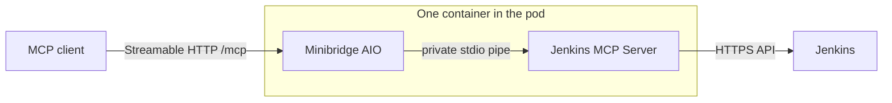

# Kubernetes, Tailscale and Argo CD deployment

## Traffic paths

```text
Hermes (tag:hermes)
  -> HTTPS 443 over tailnet
  -> Tailscale Ingress ProxyGroup / svc:jenkins-mcp
  -> Kubernetes Service jenkins-mcp:8000
  -> MCP server /mcp

MCP server Pod
  -> Jenkins MagicDNS FQDN on HTTPS 443
  -> Tailscale Egress ProxyGroup
  -> svc:jenkins TailVIP
  -> Jenkins host Tailscale Serve
  -> Jenkins loopback listener
```

## Cluster prerequisites

- Tailscale Kubernetes Operator installed in namespace `tailscale`.
- Operator identity/tag permitted to advertise Services.
- `ProxyGroup` and `DNSConfig` CRDs available.
- CoreDNS forwards the tailnet `.ts.net` zone to the IP reported by `DNSConfig/ts-dns`.
- `jenkins-mcp-secrets` exists before the Deployment becomes ready.

## Required edits before push

1. Replace `grglzrv` in the image and Argo CD manifests.
2. Replace `example-tailnet.ts.net` everywhere with the actual tailnet DNS suffix.
3. Set `JENKINS_URL` and `tailscale.com/tailnet-fqdn` to the exact `svc:jenkins` FQDN.
4. Adjust `MCP_ALLOWED_JOBS` and keep `MCP_ALLOW_DESTRUCTIVE=false` unless
   irreversible actions have a reviewed need.
5. Review namespace names in `deploy/kubernetes/tailscale/networkpolicy.yaml`;
   this Tailscale overlay opts into the policy, so fix missing client or Jenkins
   egress selectors instead of weakening it.
6. Create the Jenkins credential Secret through your secret manager.
7. Choose the plain image or the `-minibridge` Kustomize overlay. The latter is
   one bundled container and blocks `@destructive` in the shipped example.
8. Choose the audit sink deliberately. The raw manifests keep the optional file
   copy disabled and emit JSONL to process logs. If you add a writable audit
   volume and `MCP_AUDIT_LOG_PATH`, set positive `MCP_AUDIT_MAX_BYTES` and
   `MCP_AUDIT_BACKUP_COUNT` values together. Set
   `MCP_AUDIT_REQUIRED_FOR_READINESS=true` only when that file is the record of
   account and a write failure must remove the pod from Service endpoints.

## CoreDNS

```bash
kubectl apply -f deploy/kubernetes/tailscale/dnsconfig.yaml
TS_DNS_IP="$(kubectl get dnsconfig ts-dns -o jsonpath='{.status.nameserver.ip}')"
echo "Tailscale DNS IP: ${TS_DNS_IP}"
```

Add the block from `coredns-snippet.example`, forward the parent `ts.net` zone to `${TS_DNS_IP}`, then restart CoreDNS.

## Render and validate

```bash
kubectl kustomize deploy/kubernetes/overlays/production > /tmp/jenkins-mcp.yaml
kubectl apply --server-side --dry-run=server -f /tmp/jenkins-mcp.yaml
```

For the bundled Minibridge variant, render
`deploy/kubernetes/minibridge` instead. Its writable `/tmp` and
`/home/app/.config` mounts are required by the read-only root filesystem. The
Service and ingress still expose Streamable HTTP at `/mcp`; stdio exists only
as the private in-container pipe from Minibridge to Jenkins MCP Server.



Both raw MCP Services use `ClientIP` session affinity with a 600-second timeout.
This keeps all requests carrying one MCP session ID on the pod that initialized
it. If an ingress controller bypasses Service load balancing or masks the source
address, configure equivalent affinity on that controller too. A pod restart
still requires the client to reconnect and initialize a new session.

Both raw deployments also wait 5 seconds in a `preStop` hook before Kubernetes
sends SIGTERM. That window mitigates the race while terminating EndpointSlice,
Service proxy, ingress, and load-balancer state propagates; it does not make an
in-memory MCP session portable to another replica. The Helm equivalent is
`preStopDelaySeconds` (set `0` to disable). The delay consumes the same total
budget as `terminationGracePeriodSeconds`, so the chart rejects a delay greater
than or equal to the grace period.

## Deploy with Argo CD

```bash
kubectl apply -f deploy/argocd/application.yaml
argocd app get jenkins-mcp
argocd app sync jenkins-mcp
```

That raw-manifest Application follows `main` and is intended for development or
a fork. Pin `spec.source.targetRevision` to a release tag or commit for
production. The examples under `examples/argocd` use the immutable OCI Helm
chart and pin its chart version.

## Discover the MCP URL

```bash
kubectl get ingress jenkins-mcp -n jenkins-mcp
```

Use the `ADDRESS` value and append `/mcp`. Configure that URL in your MCP
client using its documented schema; there is no universal
`mcp_servers.jenkins` configuration block.

For Hermes Agent specifically, `mcp_servers` is the correct top-level key. Use
the `url` and optional `timeout` fields shown in
`deploy/hermes/mcp-config.yaml`; Hermes infers HTTP transport from `url`.

| Field | Value |
| --- | --- |
| Name | `jenkins` |
| Transport | Streamable HTTP |
| URL | `https://jenkins-mcp.<tailnet>.ts.net/mcp` |

## Verification

```bash
kubectl rollout status deployment/jenkins-mcp -n jenkins-mcp
kubectl get proxygroup,dnsconfig
kubectl get ingress,svc,pods -n jenkins-mcp
kubectl logs -n jenkins-mcp deploy/jenkins-mcp
kubectl exec -n jenkins-mcp deploy/jenkins-mcp -- \
  python -c "import json,urllib.request; print(json.load(urllib.request.urlopen('http://127.0.0.1:8081/readyz')))"
```

When file audit is enabled, the readiness payload always reports
`audit_log_writable`. A false value returns HTTP 503 only in fail-closed mode;
otherwise it stays visible while process-log auditing and MCP traffic continue.
The direct server also reports passive `jenkins.last_contact_age_seconds` and
`jenkins.last_transport_error` diagnostics without gating readiness. The
Minibridge deployment exposes its own `/` health endpoint instead, so use the
container logs to monitor both audit-file degradation and rate-limited Jenkins
transport failure/recovery messages in that mode.

From a tagged Hermes node, verify TLS and the MCP endpoint with the MCP Inspector or Hermes itself. A plain browser GET is not a valid MCP protocol test.
